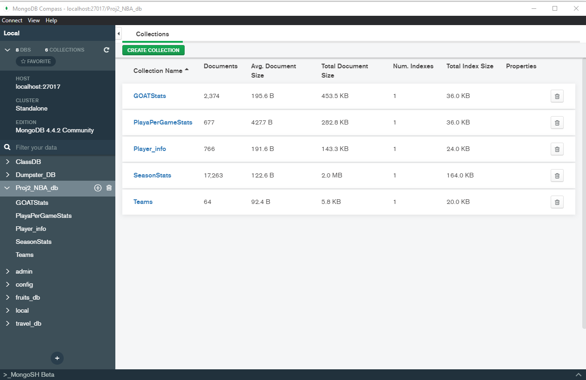

# ETL NBA Report 
#### George, Sharifah, Jim, Vena

<h4> Introduction </h4>

 &nbsp;&nbsp;&nbsp;&nbsp;&nbsp;&nbsp;&nbsp;&nbsp;For this project, we extract, transform and load raw NBA data gathered from various sources. Showcasing our ability to create an efficient process of extracting data, transforming data and loading data was the main goal. The final tables provide information on a variety of NBA player statistics. The data was gathered from different sources and using different methods, was cleaned, transformed and and finally loaded to a public database.  

<h4>Background</h4>

 &nbsp;&nbsp;&nbsp;&nbsp;&nbsp;&nbsp;&nbsp;&nbsp;This project is the second part of a larger NBA statistical analysis report. Our previous analysis was done on a similar selection of NBA player and team statistical data. The goal was to create insightful visualizations and to highlight relevant trends that became the foundations for this project moving forward. 

<h4>Purpose</h4>

 &nbsp;&nbsp;&nbsp;&nbsp;&nbsp;&nbsp;&nbsp;&nbsp;The purpose of this project is to showcase our ability to create an efficient ETL pipeline. The data was extracted from various sources, it was cleaned and tranformed in python and then uploaded to a databse on MongoDB. 

<h4>Methods</h4>

 &nbsp;&nbsp;&nbsp;&nbsp;&nbsp;&nbsp;&nbsp;&nbsp;The following methods were used; extract, transform, and load.

- Extract

 &nbsp;&nbsp;&nbsp;&nbsp;&nbsp;&nbsp;&nbsp;&nbsp;As part of the extraction process we scraped the website Basketball-Reference.com, we used the nba API python library, and downloaded csv and json files from Kaggle and Data World. This gave us enough data to move to the transform stage.

- Transform

 &nbsp;&nbsp;&nbsp;&nbsp;&nbsp;&nbsp;&nbsp;&nbsp;The first thing done was inspect the data types of all the columns within each table to see compatibility and adjust accordingly. The values in each column were then counted to make sure that all the columns have the same length. All the rows with missing or corrupted data were then removed and all unccessary columns were dropped. Different data tables were then joined together to create larger more complete data tables. Finally each table was given a primary key aswell as a foreign key to prepare for the load process. 

- Load

 &nbsp;&nbsp;&nbsp;&nbsp;&nbsp;&nbsp;&nbsp;&nbsp;The data was then uploaded to MongoDB using the py mongo python library.

<h4>Limitations</h4>

 &nbsp;&nbsp;&nbsp;&nbsp;&nbsp;&nbsp;&nbsp;&nbsp;Initially we wanted to load the tables into Postgres. However, while creating the ERD and the tables schemata we realized that the primary keys were not all unique. For example, one of the primary keys was the player names field; but the tables have a one to many and many to many relationship which would create issues when joining tables.  Alternatively, we loaded the tables into MongoDB instead. Another complication that we encountered was increased security on sites.

<h4>Results and Next Steps</h4>

 &nbsp;&nbsp;&nbsp;&nbsp;&nbsp;&nbsp;&nbsp;&nbsp;Every aspect of the ETL process was successful. We were able to extract large sets of data from multiple sources, transform the data into workable data frames and load each table into a database. The next steps to this project would involve a thorough data analysis of the tables created, looking for any interesting trends within the data. Relevant findings will then be visualized and costumized accordingly. For next steps we can explore ways to work together from the same public database; possibly use ngrok and make localhost 5432 public.

<h4>Instrumentation</h4>
<ul>

<li>VS Code</li>
<li>MongoDB</li>
<li>Quick DBD</li>
<li>Jupyter Notebook</li>

</ul>

<h4>References</h4>
<ul>

<li> <a href="https://www.kaggle.com/">Kaggle</a></li>
<li> <a href="https://data.world/">Data World</a></li>
<li> <a href="https://www.basketball-reference.com/">Basketball Reference</a></li>
<li> <a href="https://pypi.org/project/nba-api/">NBA API Python Library</a></li>
</ul>

